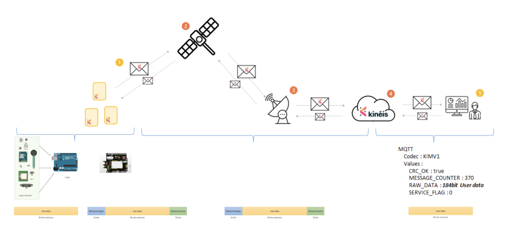

  
# Description
This repository contains the Arduino sketch, instructions, payload converters and everything necessary to make the initial satellite connection from an Arduino device towards the [Verhaert Connect](https://verhaert.allthingstalk.com) platform via [Kineis](https://www.kineis.com) possible and to demonstrate the connectivity.  

# How it works
Arduino (Seeeduino Lotus in this case) is connected to a number of sensors on the same PCB. The Kineis KIM1 module, which enables satellite connectivity, connects to the Arduino as a hat and receives payloads from it. KIM1 then sends the payload directly to Kineis satellites which then relay it to a Kineis ground station, then to Kineis Service platform, and finally to Verhaert Connect platform, where you see your data.  
  
The device collects and sends the following data:
- Temperature
- Relative Humidity
- Air Pressure
- Light (amount of light)
- Sound (loudness)
- Potentiometer value

# Hardware

> **IMPORTANT:**  
> Make sure not to break off any sensors from the Grove Starter Kit as it's almost impossible to use the grove cables with the Kineis KIM1 module plugged on top of the Seeduino Lotus (Arduino).

Hardware Required:
- [Grove Starter Kit](https://wiki.seeedstudio.com/Grove-Beginner-Kit-For-Arduino/)
- [Kineis SPP (KIM1)](https://www.kineis.com/en/space_priority_program/) + Antenna
- USB Cable

## Steps
- Plug the Kineis KIM1 module onto the Seeduino Lotus and make sure the orientation is correct.
- Plug the USB cable into your computer and into the Seeduino Lotus (Grove Starter Kit).

# Software

## Steps
- Install the newest [Arduino IDE](https://www.arduino.cc/en/software)
- Download this repository and open *"Cassini_Example_Sketch.ino"* in folder *"Cassini_Example_Sketch"*
- Open Library Manager on the left side (3rd icon from the top), then search for and install:
    - **'Grove Temperature And Humidity Sensor'** by Seeed Studio
    - **'Grove - Barometer Sensor BMP280'** by Seeed Studio
- Click **Select Board** in the upper corner in Arduino IDE and select **Select other board and port...**, then search for and select **Arduino Uno** and choose the appropriate port.
- Compile and upload the sketch.
- Open Serial Monitor in Arduino IDE to see the debug information from the Arduino device.

# Platform
- [Verhaert Connect Platform](https://verhaert.allthingstalk.com)  
- [AllThingsTalk Binary Conversion Language (ABCL) guide](https://docs.allthingstalk.com/developers/custom-payload-conversion/)

## Steps
- On Verhaert platform, add a new Arduino device.
- Go to **Device Settings > Connectivity** and choose **Kineis Satellite**.
- Find the Device ID of your Kineis KIM1 module (6 numbers), enter it in the **Kineis Device ID** field and click **Connect to Network**.
> Make sure to disconnect (**Device Settings > Connectivity > Disconnect**) before handing off the Kineis KIM1 module to other attendees so they can connect it to their device on the platform.
- Create the following assets:

| Name | Title | Type   | Kind   | Unit |  Advanced |
|-------|-------|--------|--------|------|------|
| temperature | Temperature | number | sensor | °C | Min: -100, Max: 100 |
| humidity | Humidity | integer | sensor | % | Min: 0, Max: 100 |
| pressure | Pressure | integer | sensor | mbar | Min: 0, Max: 2000 |
| light | Light | integer | sensor | | Min: 0, Max: 255 |
| sound | Sound | integer | sensor | | Min: 0, Max: 255 |
| potentiometer | Potentiometer | integer | sensor | | Min: 0, Max: 255 |

- Open the file *"ABCL Converter.json"* from this repository and copy its contents.
- Go to **Device Settings > Payload Formats**, choose **ABCL Conversion**, paste the contents of the aforementioned file and save.

# Important Details
- Make sure to put the device outside when a satellite is passing by.
- The buzzer on the kit will produce a sound:
    - When KIM1 is not detected: Two times for 1 sec with a 500ms pause
    - When payload sending fails: One time for 200ms
    - When the button is pressed and registered: One time for 50ms
- The LED on the kit will light up when the KIM1 module is active.
- The range for values of light, sound and potentiometer is from 0 to 255.
- The payload being sent to Kineis needs to be **exactly** 23 bytes.
- If you change the data payload in Arduino, make sure to reflect that in the [ABCL](https://docs.allthingstalk.com/developers/custom-payload-conversion/) on the platform, as well as in assets.
- Do not use GPIO pin number 4 on the Arduino. This pin is used to power on/off the Kineis KIM1 module. When the Arduino is connected to the grove starter kit, GPIO 4 is the LED module, so you can observe it to figure if the KIM1 is on or off.